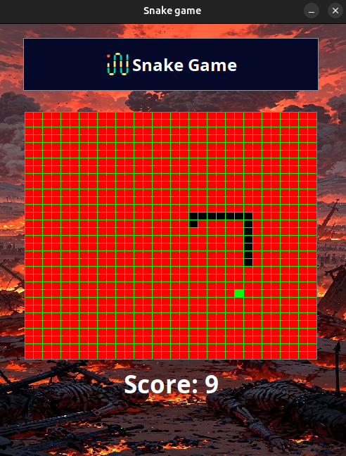
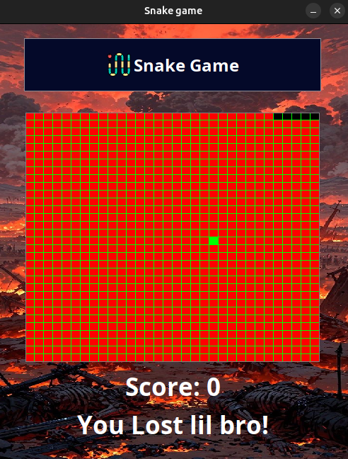
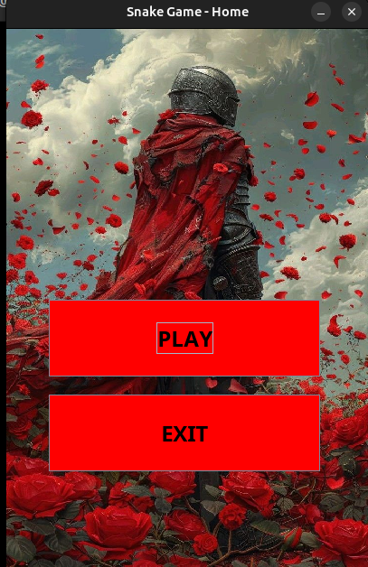

# 🐍 Snake Game in Java

Welcome to the classic Snake Game implemented in Java using Swing!

This project recreates the timeless arcade game where the player controls a growing snake, avoiding collisions with walls and itself, while chasing food items.


## Demo









## 🛠️ Installation & Build Instructions

Clone the repository and follow these steps to compile and run the game:

### 📥 1. Clone the Repository

```bash
git clone https://github.com/AryanERTash/SnakeGame.git
cd SnakeGame

# Create output directory
mkdir -p out

# Compile all Java source files into the out/ directory
javac -d out *.java

# Copy resource files (e.g., images, sounds) to the output directory
cp -r res out/

# Package everything into a runnable JAR file
jar cfm out/SnakeGame.jar manifest.txt -C out .

```

## ▶️ Run the Game


```bash
java -jar out/SnakeGame.jar